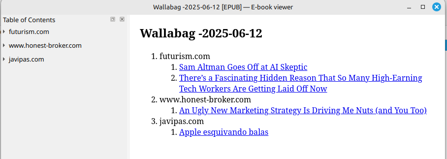
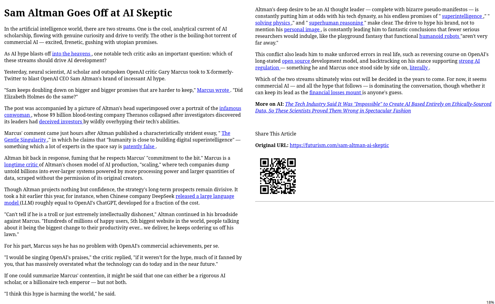

# Arts2ebook

**arts2ebook** is a script that:

- Pulls articles saved in a [Wallabag](https://wallabag.org/) instance
- Creates an EPUB, grouped by domain, with a QR and link to the source in each article
- Marks them as read
- Sends it to an email address.

Because some websites aren't correctly displayed in Wallabag, it's possible to set up credentials for the [Full-Text RSS API](https://rapidapi.com/fivefilters/api/full-text-rss) and specify certain domains for which URLs will be retrieved using the API instead of the content provided by Wallabag.





This software was developed after Pocket's shutdown, which caused the [Pocket+ recipe for Calibre](https://github.com/mmagnus/Pocket-Plus-Calibre-Plugin) to stop working.

## Installation

- Download the script
- Copy the .env.sample configuration file into .env and populate values
- It is recommended to generate a virtual environment ```python -m venv .env && source .venv/bin/activate```
- Install requirements with ```pip3 install -r requirements.txt```
- Execute the script with ```python3 arts2ebook.py```

## Configuration parameters

### Wallabag parameters

- WALLABAG_API_BASE_URL
- WALLABAG_CLIENT_ID
- WALLABAG_CLIENT_SECRET
- WALABAG_USERNAME
- WALABAG_PASSWORD


### Full-Text API

- FULLTEXTRSS_API_KEY

### SMTP parameters

- SMTP_SERVER
- SMTP_PORT
- SMTP_USER
- SMTP_PASSWORD
- SMTP_FROM
- EMAIL (destination email)

### Domains parameters

- DOMAINS_EXCLUDED => Domains that won't be processed
- DOMAINS_EXTRACT_USING_API= => Domains wich articles will be extracted using the API, instead of the conteny of the article in Wallabag
- DOMAINS_THAT_NEED_ENCODING_FIX => Only for articles in Wallabag (that is, articles which domains isn't in DOMAINS_EXCLUDED or in DOMAINS_EXTRACT_USING_API) that have encoding problems. Including it's domain in these parameter might resolv the issue
- MARK_AS_READ
- SEND_EMAIL

